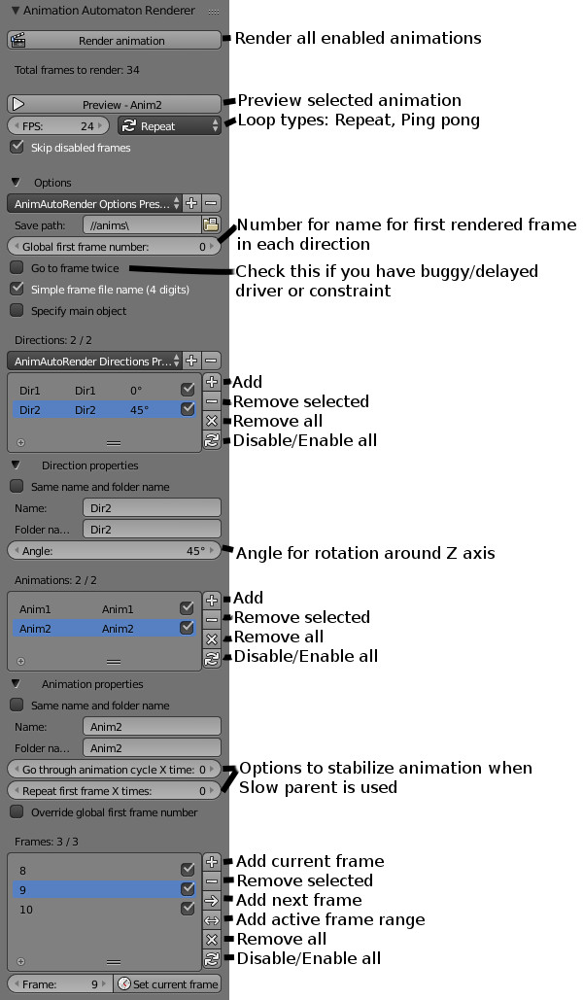

Animation Automaton Renderer
==========================

Blender add-on to automate rendering sprite animations

This add-on automates rendering sprite animation by setting proper frame, rotating main object in specified directions and saves rendered frames in folder structure: save_path / animation_folder_name / direction_folder_name (if there is more than one enabled directions) / frame_name. Also it have option to preview animation by cycling through frames defined for it. Should work with any renderer (tested with Blender Render and Cycles).

## Quick tutorial

1. Add directions in directions list. When you select one of them, in properties below, you can specify name, folder name and direction in degrees.
2. Add animations in animations list. When you select one of them, in properties below, you can specify name, folder name and in directions list you can specify which directions this animation will use.
3. To selected animation add frames in frames list. You can add one by one or add range defined in timeline.
4. Select object which you wan to bo rotated (like character's armature) and click "Rander animation" button in the top of panel to render all enabled animations.
5. Enjoy! :)

## Quick overview

https://www.youtube.com/watch?v=fXW9ZPg4e1M

## GUI

